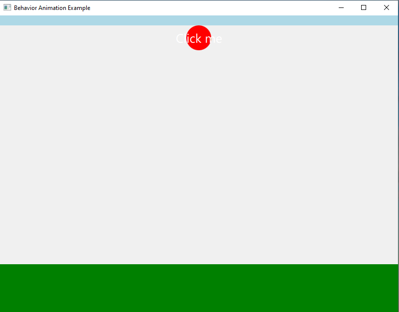
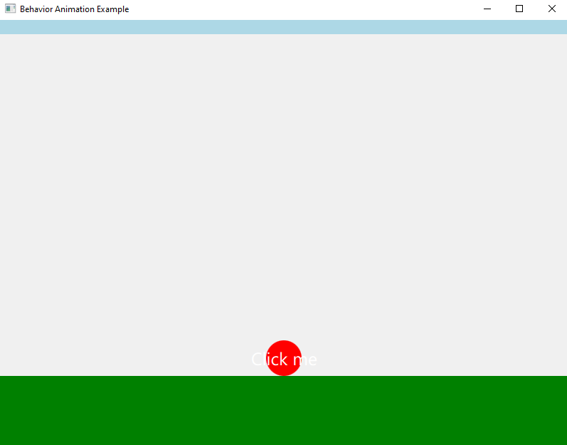

# 🎈 QML Fluid Elements and Animation – Bouncy Ball

This is a simple example demonstrating smooth animation and fluid behavior using **QML**. The app features a red ball that, when clicked, **bounces** up and down a few times before coming to rest.

## 🚀 Features

- Written in **QML**
- Smooth animation using built-in Qt behaviors
- Interactive red ball with bounce effect
- Clean and minimal UI

## 🖱️ How it works

Click the red ball, and it will:

1. Jump up  
2. Bounce down a few times and settle

Click again and it will:

1. Go down  
2. Bounce down a few times and settle
   
## 🖼️ Preview

### Before Click

### After Click

## 📖 Chapter

**QML Fluid Elements and Animation**

