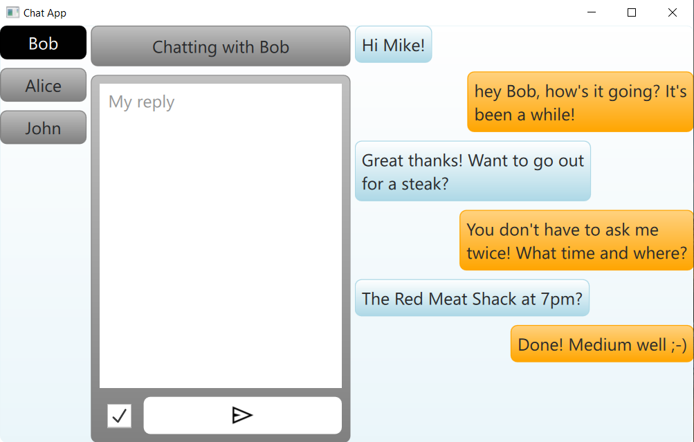
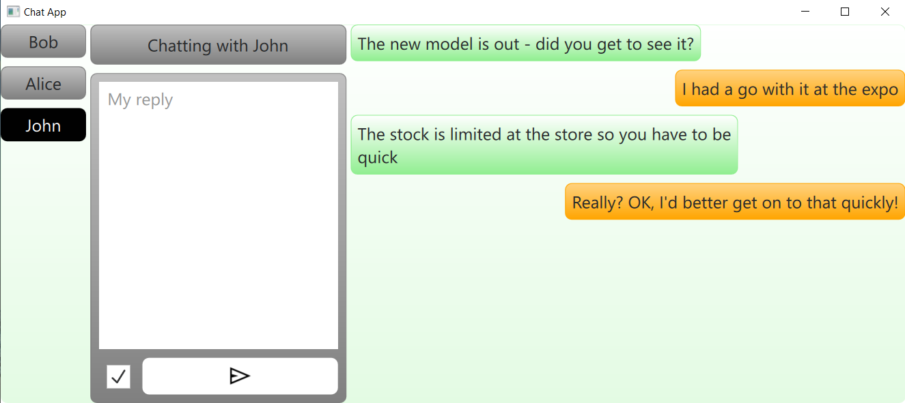
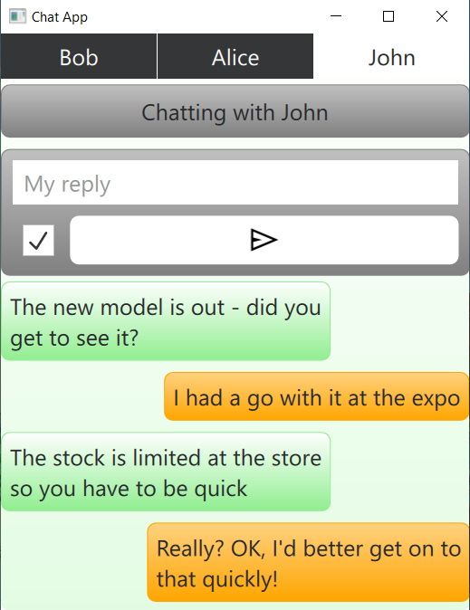
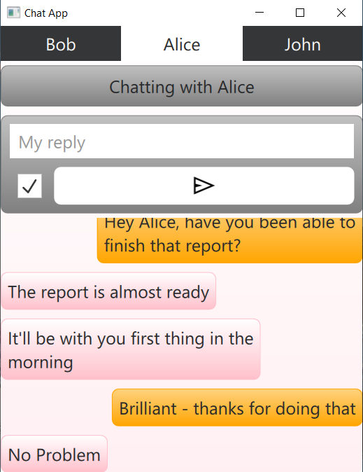

# 📱💬 Qt Quick challange - chat application

This is a simple yet responsive chat interface built using **Qt Quick Positioners and Layouts**. The application adapts to both desktop and mobile views, simulating a basic chat experience with user-friendly UI components and layout customization.

---

## 🧱 Base Version

The base version of the chat application includes:

- A **desktop-friendly layout** using `Qt Quick Positioners and Layouts`.
- Utilization of `Layout` attached properties:
  - `Layout.fillWidth`, `Layout.fillHeight`
  - `Layout.preferredWidth`, `Layout.preferredHeight`
  - `Layout.alignment`, `Layout.margins`
- Key sections in the layout:
  - **Header** displaying the name of the chat participant
  - **Two-way static chat bubbles** to simulate conversation
  - **Input field** for typing a reply
  - **Send button**
- Chat bubbles:
  - Contain example text
  - Aligned left or right depending on the speaker
  - Use alternating background colors for differentiation

---

## 🚀 Extension: Responsive Mobile/Desktop Layout Switching

This extension adds advanced layout responsiveness to enhance usability across different devices:

- **Dynamic switching between desktop and mobile layouts** based on window size
- Use of `LayoutItemProxy` to manage shared elements between layouts
- Items are moved outside of the layout and targeted by proxies
- Mobile view includes:
  - A redesigned layout optimized for small screens
  - A `StackLayout` combined with `TabBar` and `TabButton` for switching between chats
- Logic to handle both **portrait** and **landscape** orientations in mobile view

---

## 🖥️ Desktop Layout

---

## 📱 Mobile Layout

